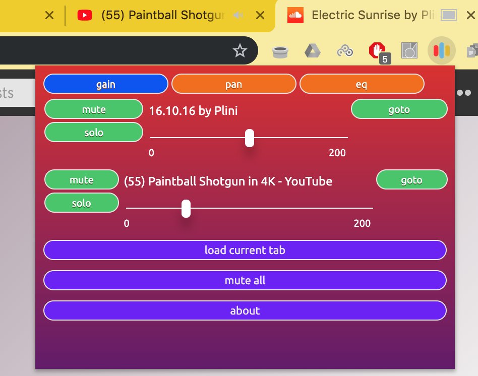
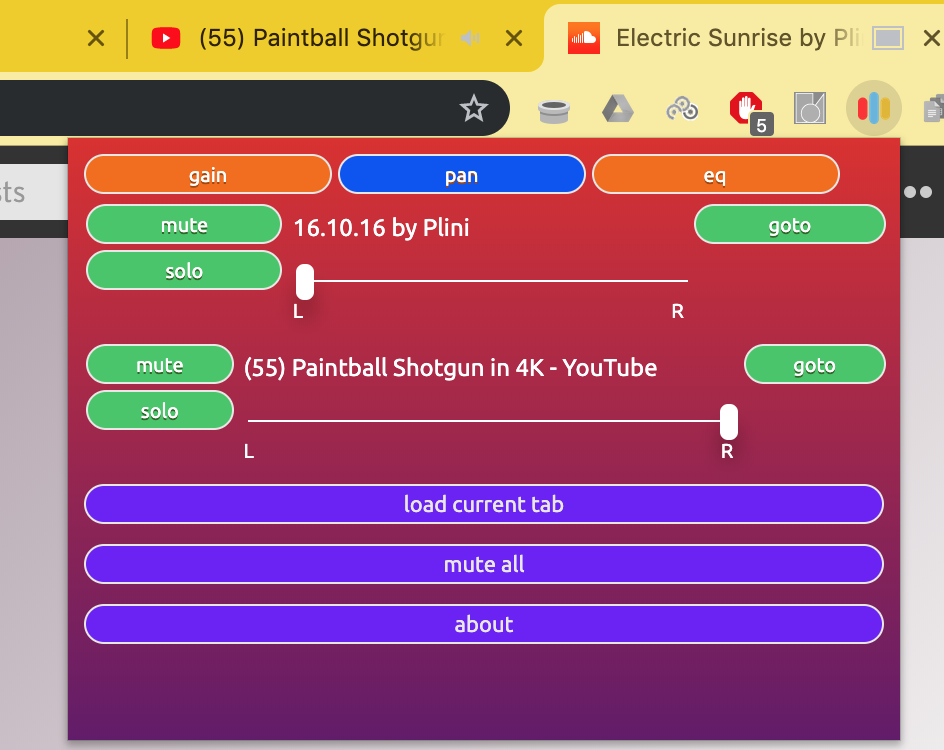
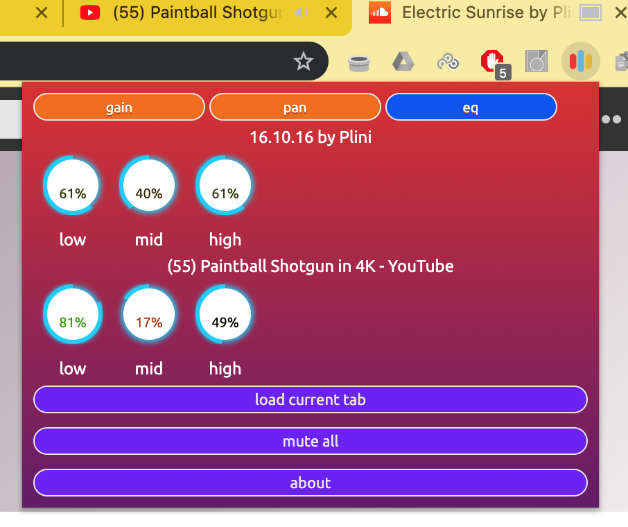
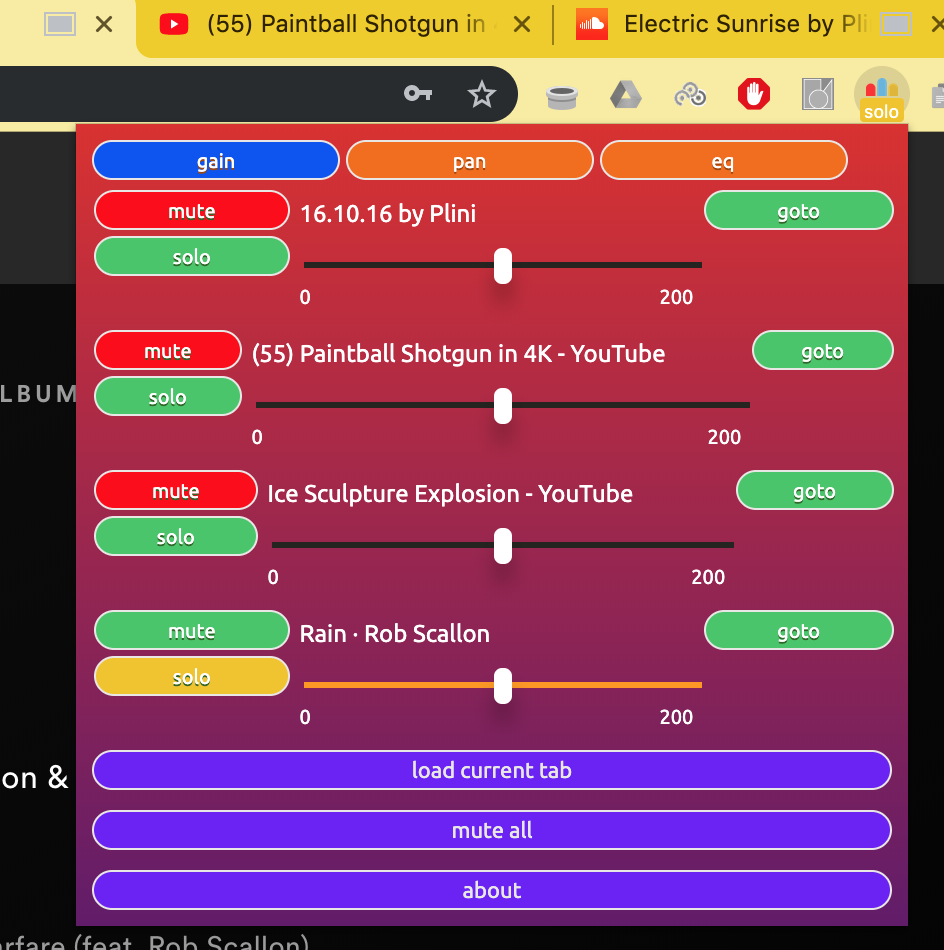

# Mix-Tab:

Mix-Tab is a chromium based web extension for managing the audio of tabs currently open in your browser.
Mix-Tab enables a number of features:
* increase the volume to double its normal output or reduce it down to zero
* balance a tab's EQ with a three band eq
* control the pan (L-R balance) of the tab.
* mute a tab
* solo a tab
* mute all tabs

### Audio Detection
Mix-Tab automatically detects any page playing HTML5 audio and controls for those tabs appear in the popup immediately.
For non html5 audio, this can only be captured through a user action, and so requires users to press the load current tab button.

### Installation
To install, download the zip folder link from the release, unpack it, go into the extension settings in chrome and select load unpacked extension (you will need to have developer mode turned on in the extensions page).

### Screenshots
Gain and Pan are controlled by a mixer style slider:

Eq is three band, with the following properties:
* low dial
  * frequency: 126Hz
  * Q: 0.553
* mid dial
  * frequency: 1250Hz
  * Q: 0.517
* high dial
  * frequency: 7500Hz
  * Q: 0.567
Each parameter can provide a 20db boost or attenuation and defaults to 0db.
Each parameter is controlled by a mixer style dial:

Mute and Solo looks like this:

### Implementation details

