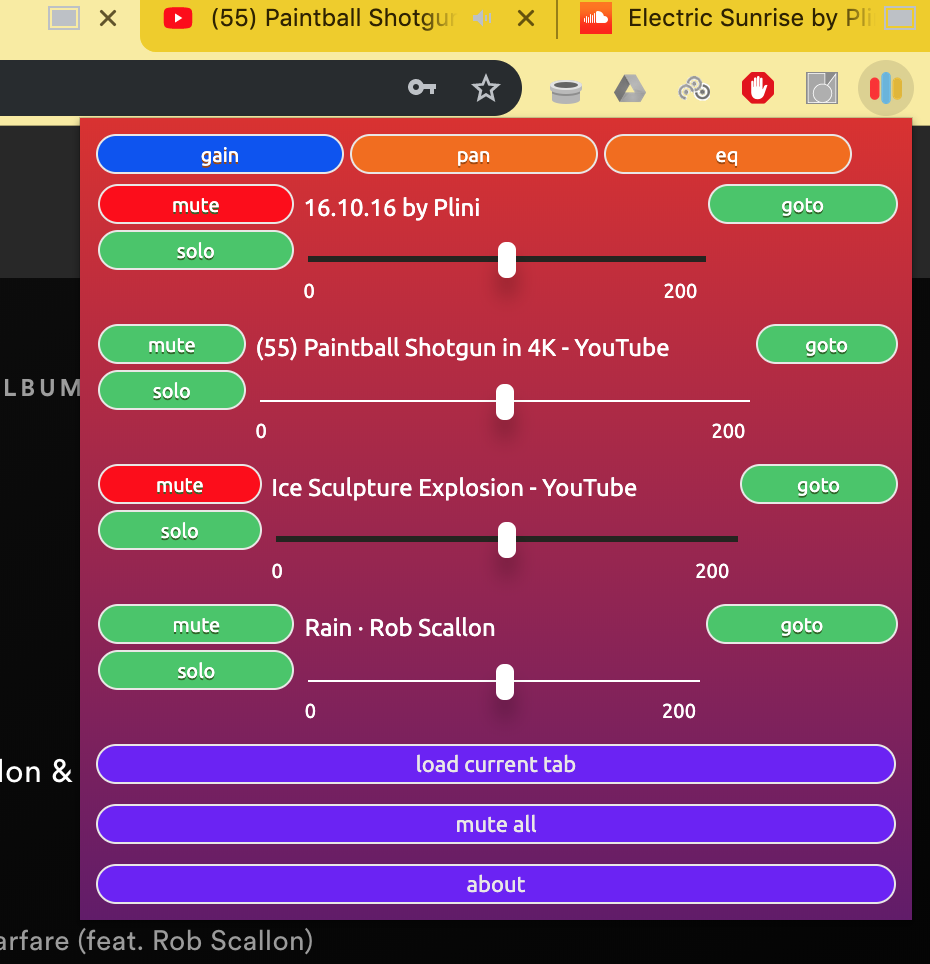

# Mix-Tab:
Mix-Tab is a chromium based web extension for managing the audio of tabs currently open in your browser.
Mix-Tab enables a number of features:
* increase the volume to double its normal output or reduce it down to zero
* balance a tab's EQ with a three band eq
* control the pan (L-R balance) of the tab.
* mute a tab
* solo a tab
* mute all tabs

### Audio Detection
Mix-Tab automatically detects any page playing HTML5 audio and controls for those tabs appear in the popup immediately.
For non html5 audio, this can only be captured through a user action, and so requires users to press the load current tab button.

### Installation
To install, download the zip folder link from the release, unpack it, go into the extension settings in chrome and select load unpacked extension (you will need to have developer mode turned on in the extensions page).

### Screenshots
Gain and Pan are controlled by a mixer style slider:

Eq is three band, with the following properties:
* low dial
  * frequency: 126Hz
  * Q: 0.553
* mid dial
  * frequency: 1250Hz
  * Q: 0.517
* high dial
  * frequency: 7500Hz
  * Q: 0.567

Each parameter can provide a 20db boost or attenuation and defaults to 0db.
Each parameter is controlled by a mixer style dial:

Mute and Solo looks like this:

### Implementation details
The system works by injecting java script into every page that the user visits, which checks for html5 audio tags. If they exist it creates an [audio context](https://developer.mozilla.org/en-US/docs/Web/API/AudioContext) along with a gain node, a pan node and three [biquad filter nodes](https://developer.mozilla.org/en-US/docs/Web/API/BiquadFilterNode) with their type set to peaking.

This permits automatic HTML5 audio capture, and upon clicking on the extension logo it will have sliders visible for all current html5 audio tags. However, for other sources of audio (from RTC peer connections or user media (device audio input - e.g built in webcam/microphone) is not *automatically* captured but can be requested by the user through the `load current tab` button, however I could attempt to implement automatic loading in the future.
The load current tab uses the [chrome.tabCapture](https://developers.chrome.com/extensions/tabCapture) api to capture the media stream of the currently active tab (that means capture all sources of audio collated together in one stream for the tab the user is currently viewing). This is a much simpler system that captures all kinds of audio, not just HTML5, but alas does not permit automatic detection. It depends on 'browser action' to give permission for access, as in if the user does not give explicit permission, the extension is not given permission to access the chrome.tabCapture api. An easy way to drive this 'browser action' is through a button that the user clicks on, hence the `load current tab` button.

The eq system is quite simple, but built upon the very powerful web audio api, and another project similar to this one would be to give a full eq control to the user for a given tab, along with a graphic eq and analyser that allows the user to see currently active frequencies, have more frequency bands, adjust their frequency and adjust their Q.

This injected java script is only activated when the tab actually becomes audiable (see the chrome.tabs api), so only tabs with audio actually playing will be attached to. The system attempts to resolve crossorigin issues but will not force the crossorigin attribute in the DOM header, (as in it does not look at users DOM headers and manuipulate them to include the crossorigin tag) so audio that is loaded from a source other than on a page (and other than the already audiable source) will be loaded assuming the header permits.

### Known bugs
* For some unknown reason, occasionaly all audio from a tab will have its entire frequency range shifted down a few Hz, as if someone detuned a song's key fractionally or if voices in a video had gone through a voice changer to make them ever so slightly deeper. (It is not affecting playback speed, ie audio streams are not getting slower).
* There is occasionally a pop when pressing the load currnt tab button - appears to be to do with creating the audio context on that tab.
* Due to what I think is a CSS issue, sometimes there is a slight stutter when loading the extension popup window.
* The global information on the currently soloed tab's id doesn't always seem to be correct in the popup script when the sliders are generated, however the dependency on the data has been removed at this point so the bug doesn't affect functionality.

